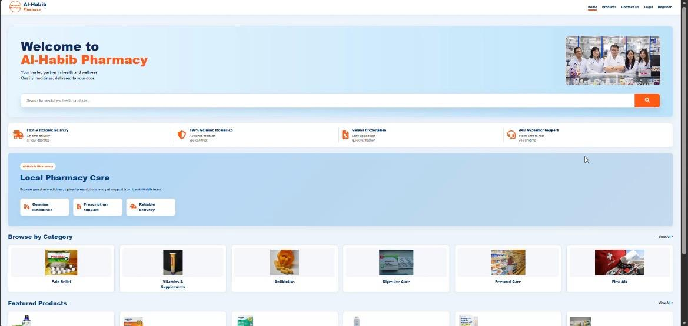
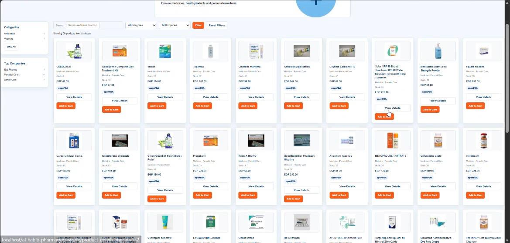
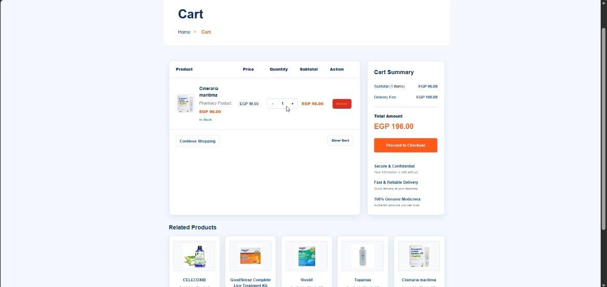
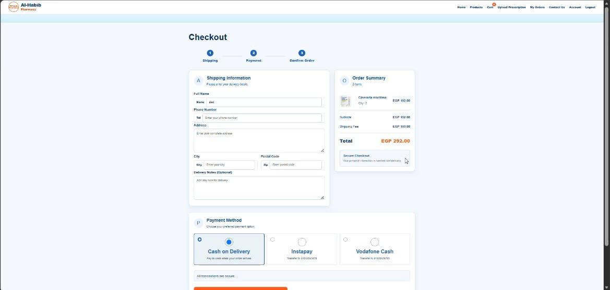
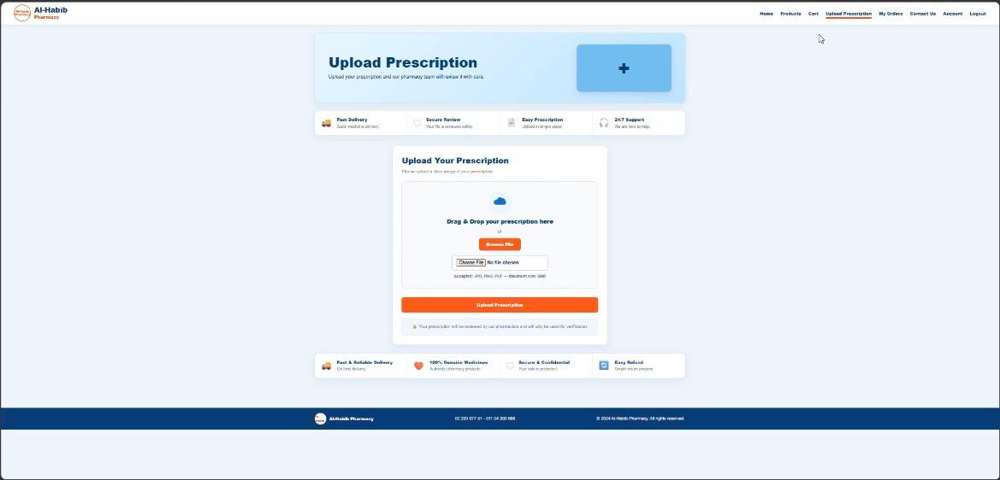
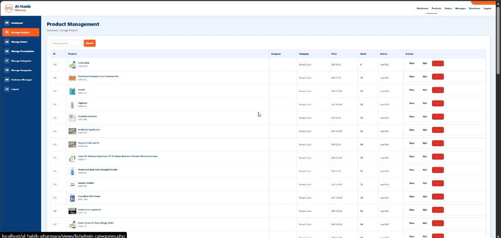

# Al-Habib Pharmacy Management System

A full-stack academic pharmacy and e-commerce web application built with PHP, MySQL, HTML, CSS, and JavaScript. It supports customer shopping workflows, prescription uploads, order management, and an administrative dashboard.

## Project Preview

<table>
  <tr>
    <td></td>
    <td></td>
  </tr>
  <tr>
    <td align="center"><b>Home Page</b></td>
    <td align="center"><b>Product Catalogue</b></td>
  </tr>
  <tr>
    <td></td>
    <td></td>
  </tr>
  <tr>
    <td align="center"><b>Shopping Cart</b></td>
    <td align="center"><b>Checkout</b></td>
  </tr>
  <tr>
    <td></td>
    <td></td>
  </tr>
  <tr>
    <td align="center"><b>Prescription Upload</b></td>
    <td align="center"><b>Admin Product Management</b></td>
  </tr>
</table>

More screenshots are available in [`docs/screenshots`](docs/screenshots/).

## Highlights

- Customer registration, login, logout, and password-reset flows
- Product catalogue with categories, companies, search, and product details
- Shopping cart, checkout, addresses, and order tracking
- Prescription upload and administrative review
- Admin dashboard for products, categories, companies, orders, messages, and prescriptions
- Multiple payment methods implemented with the Strategy pattern
- Database access examples using a Singleton pattern
- Optional OpenFDA product import service
- Responsive customer and administrator interfaces

## Technology Stack

- PHP 8+
- MySQL or MariaDB
- HTML5, CSS3, and vanilla JavaScript
- PDO prepared statements
- Apache through XAMPP or WAMP

## Project Structure

```text
assets/          Stylesheets, scripts, and images
controllers/     Request and business-flow controllers
database/        Database classes and SQL scripts
models/          Application data models
patterns/        Singleton and Strategy pattern examples
services/        OpenFDA and product-image services
uploads/         Runtime user uploads (ignored by Git)
views/fe/        Customer and administrator pages
docs/screenshots Project screenshots
```

## Local Setup

1. Install XAMPP or WAMP and start Apache and MySQL.
2. Copy the repository folder into `htdocs` (XAMPP) or `www` (WAMP).
3. Create a database named `al_habib_pharmacy`.
4. Import `database/schema.sql` using phpMyAdmin or the MySQL command line.
5. Check the development database settings in `database/MySQL.php`:

```php
private $host = "localhost";
private $dbname = "al_habib_pharmacy";
private $username = "root";
private $password = "";
```

6. Open `http://localhost/al-habib-pharmacy-management-system/`.

## Demo Accounts

The seed database includes these academic demo accounts:

| Role | Email | Password |
|---|---|---|
| Administrator | `admin@alhabib.com` | `admin123` |
| Customer | `ahmed@example.com` | `123456` |

Do not reuse these credentials in a deployed system.

## Privacy and Security Notes

- Uploaded prescription files are intentionally excluded from Git tracking.
- The included database credentials target a local development environment only.
- Before production deployment, move credentials to environment variables, add CSRF protection, enforce upload validation, configure HTTPS, and disable detailed database errors.

## Academic Scope

This project demonstrates end-to-end web development and software-design concepts. It is not intended to provide medical advice or to operate as a production pharmacy without further security, legal, accessibility, and compliance work.

## Author

Ziad Mohamed
